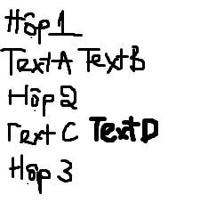

# PHẦN A — KIỂM TRA ĐỌC HIỂU (20 điểm)
# Câu A1 (5đ) — HTTP & Browser
1. Khi bạn gõ https://shopee.vn vào trình duyệt và nhấn Enter, hãy liệt kê đúng thứ tự ít nhất 5 bước xảy ra (từ DNS lookup đến render).
- DNS Look up (Phân giải tên miền) -> Thiết lập kết nối TCP -> Thiết lập bảo mật TLS (HTTPS) -> Gửi HTTP Request -> Server trả HTTP Response -> Render trang web.
2. Trong DevTools của Chrome, tab Network cho thấy thông tin gì? Hãy mở một trang web bất kỳ, chụp screenshot tab Network và đánh dấu (vẽ mũi tên/khoanh tròn) vào:
- Status Code của request đầu tiên
- Tổng thời gian load trang
- Một request trả về file CSS


# Câu A2 (5đ) — Semantic HTML
Đọc chương 04, trả lời: Tại sao trang web dưới đây bị Google đánh giá SEO thấp? Liệt kê ít nhất 4 lỗi semantic và sửa lại.
- Có 4 lỗi:
1. Dùng ``` <div>``` thay vì thẻ semantic layout
Google không hiểu cấu trúc trang — đâu là header, main, footer.
2. Tiêu đề sản phẩm không dùng thẻ heading ``` (<h1>, <h2>...) ```
Google dùng heading để hiểu nội dung chính của trang. ``` <div class="title"> ``` không có giá trị SEO.
3. Thẻ ``` ``` thiếu thuộc tính alt
Google Images không thể index ảnh, và bị trừ điểm accessibility.
4. Navigation không dùng thẻ ``` <nav>```
Google không nhận diện được menu điều hướng, ảnh hưởng đến crawling.

# Câu A3 (5đ) — Block vs Inline
Không chạy code, hãy vẽ tay (hoặc mô tả bằng text art) kết quả hiển thị của đoạn HTML sau. Giải thích tại sao.


- Thẻ ``` <div> ``` thuộc loại Block, chiếm toàn bộ chiều ngang, tự xuống dòng trước & sau.
- Thẻ ``` <span> ``` thuộc loại Inline, chỉ rộng bằng nội dung, nằm cùng dòng với phần tử kế tiếp.
- Thẻ ``` <strong> ``` thuộc loại inline Giống <span> nhưng in đậm, vẫn nằm cùng dòng.

# Câu A4 (5đ) — Table
Đọc chương 05. Giải thích sự khác nhau giữa <thead>, <tbody>, <tfoot>. Tại sao KHÔNG NÊN dùng table để tạo layout trang web? (Ghi rõ ít nhất 3 lý do)
|Thẻ|Vị Trí|Vai trò|
|:---|:------:|-------:|
|```<thead>```|Đầu bảng|Chứa hàng tiêu đề cột ```(<th>)```|
|```<tbody>```|Giữa bảng|Chứa dữ liệu chính của bảng ```(<td>)```|
|```<tfoot>```|Cuối bảng|Chứa hàng tổng kết / chú thích|

- Không nên dùng table để tạo layout trang web vì: 
1. Lý do 1 — Sai ngữ nghĩa (Semantic)
```<table>``` được thiết kế để hiển thị dữ liệu dạng bảng, không phải để chia cột/hàng cho giao diện. Google và screen reader sẽ hiểu nhầm cấu trúc trang → SEO thấp, accessibility kém.
2. Lý do 2 — Khó responsive (Mobile)
Table có chiều rộng cố định, không tự co giãn theo màn hình. Trên điện thoại, layout table thường bị vỡ hoặc tràn ngang — trong khi Flexbox / CSS Grid xử lý responsive dễ dàng hơn nhiều.
3. Lý do 3 — Hiệu năng render chậm
Trình duyệt phải đọc toàn bộ table trước khi vẽ bất kỳ ô nào (vì cần tính chiều rộng cột). Trang nhiều table lồng nhau sẽ bị chậm hiển thị đáng kể.

# PHẦN B - Bài B3 (15đ) - Debug HTML
- File HTML dưới đây có ít nhất 10 lỗi (cả syntax lẫn semantic). Tìm và sửa TẤT CẢ.
- Tạo file debug.html cho bản sửa. Trong answers.md, liệt kê từng lỗi theo format:
- Lỗi 1: Dòng 1 — <!DOCTYPE> thiếu html — Sửa thành ```<!DOCTYPE html>```
- Lỗi 2: Dòng 2 — ```<html>``` thiếu thuộc tính lang — Sửa thành ```<html lang="vi">```
- Lỗi 3: Dòng 4 — ```<title>``` không có thẻ đóng — Sửa thành ```<title>Trang web</title>```
- Lỗi 4: Dòng 5 — ```<meta charset="utf8">``` sai giá trị và đặt sau ```<title>``` — Sửa thành ```<meta charset="UTF-8">``` và đặt trước ```<title>```
- Lỗi 5: Dòng 8 — ```<h1>``` đóng sai, viết ```<h1>``` thay vì ```</h1>``` — Sửa thành ```</h1>```
- Lỗi 6: Dòng 10 — ```<header>``` đặt sau ```<h1>```, tiêu đề và nav phải nằm trong ```<header>``` — Chuyển ```<h1>``` vào bên trong ```<header>```
- Lỗi 7: Dòng 12 — href="home" thiếu dấu / — Sửa thành href="/home"
- Lỗi 8: Dòng 12 — ```<a href="home">``` Trang chủ ```<a>``` đóng thẻ sai, thiếu / — Sửa thành ```</a>```
- Lỗi 9: Dòng 19, 27 — Dùng ```<h3>``` cho tiêu đề section trong khi ```<h2>``` chưa được dùng (nhảy cấp heading) — Sửa thành ```<h2>```
- Lỗi 10: Dòng 21 — `````` thiếu dấu " bao src và thiếu thuộc tính alt — Sửa thành ``````
