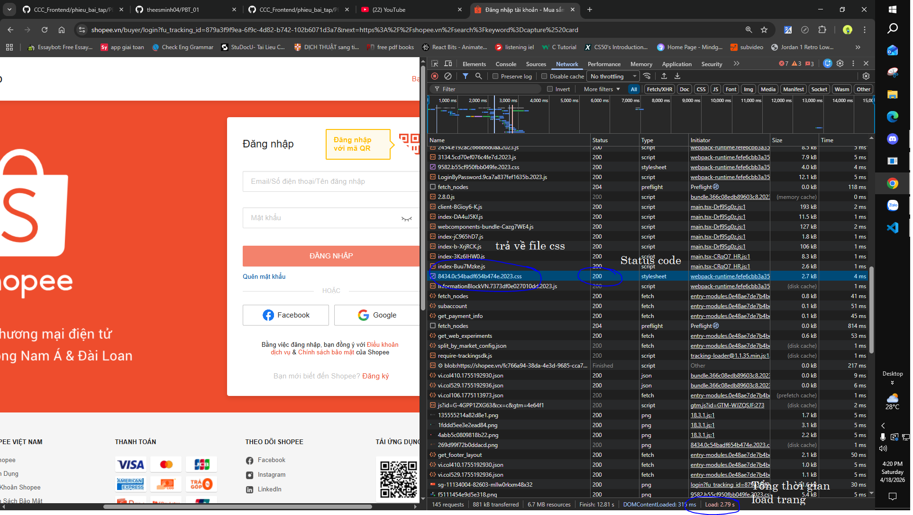

# PHẦN A — KIỂM TRA ĐỌC HIỂU (20 điểm)
# Câu A1 (5đ) — HTTP & Browser
1. Khi bạn gõ https://shopee.vn vào trình duyệt và nhấn Enter, hãy liệt kê đúng thứ tự ít nhất 5 bước xảy ra (từ DNS lookup đến render).
- DNS Look up (Phân giải tên miền) -> Thiết lập kết nối TCP -> Thiết lập bảo mật TLS (HTTPS) -> Gửi HTTP Request -> Server trả HTTP Response -> Render trang web.
2. Trong DevTools của Chrome, tab Network cho thấy thông tin gì? Hãy mở một trang web bất kỳ, chụp screenshot tab Network và đánh dấu (vẽ mũi tên/khoanh tròn) vào:
- Status Code của request đầu tiên
- Tổng thời gian load trang
- Một request trả về file CSS


# Câu A2 (5đ) — Semantic HTML
Đọc chương 04, trả lời: Tại sao trang web dưới đây bị Google đánh giá SEO thấp? Liệt kê ít nhất 4 lỗi semantic và sửa lại.
- Có 4 lỗi:
1. Dùng ``` <div>``` thay vì thẻ semantic layout
Google không hiểu cấu trúc trang — đâu là header, main, footer.
2. Tiêu đề sản phẩm không dùng thẻ heading ``` (<h1>, <h2>...) ```
Google dùng heading để hiểu nội dung chính của trang. ``` <div class="title"> ``` không có giá trị SEO.
3. Thẻ ``` ``` thiếu thuộc tính alt
Google Images không thể index ảnh, và bị trừ điểm accessibility.
4. Navigation không dùng thẻ ``` <nav>```
Google không nhận diện được menu điều hướng, ảnh hưởng đến crawling.

# Câu A3 (5đ) — Block vs Inline
Không chạy code, hãy vẽ tay (hoặc mô tả bằng text art) kết quả hiển thị của đoạn HTML sau. Giải thích tại sao.


- Thẻ ``` <div> ``` thuộc loại Block, chiếm toàn bộ chiều ngang, tự xuống dòng trước & sau.
- Thẻ ``` <span> ``` thuộc loại Inline, chỉ rộng bằng nội dung, nằm cùng dòng với phần tử kế tiếp.
- Thẻ ``` <strong> ``` thuộc loại inline Giống <span> nhưng in đậm, vẫn nằm cùng dòng.

# Câu A4 (5đ) — Table
Đọc chương 05. Giải thích sự khác nhau giữa <thead>, <tbody>, <tfoot>. Tại sao KHÔNG NÊN dùng table để tạo layout trang web? (Ghi rõ ít nhất 3 lý do)
|Thẻ|Vị Trí|Vai trò|
|:---|:------:|-------:|
|```<thead>```|Đầu bảng|Chứa hàng tiêu đề cột ```(<th>)```|
|```<tbody>```|Giữa bảng|Chứa dữ liệu chính của bảng ```(<td>)```|
|```<tfoot>```|Cuối bảng|Chứa hàng tổng kết / chú thích|

- Không nên dùng table để tạo layout trang web vì: 
1. Lý do 1 — Sai ngữ nghĩa (Semantic)
```<table>``` được thiết kế để hiển thị dữ liệu dạng bảng, không phải để chia cột/hàng cho giao diện. Google và screen reader sẽ hiểu nhầm cấu trúc trang → SEO thấp, accessibility kém.
2. Lý do 2 — Khó responsive (Mobile)
Table có chiều rộng cố định, không tự co giãn theo màn hình. Trên điện thoại, layout table thường bị vỡ hoặc tràn ngang — trong khi Flexbox / CSS Grid xử lý responsive dễ dàng hơn nhiều.
3. Lý do 3 — Hiệu năng render chậm
Trình duyệt phải đọc toàn bộ table trước khi vẽ bất kỳ ô nào (vì cần tính chiều rộng cột). Trang nhiều table lồng nhau sẽ bị chậm hiển thị đáng kể.

# PHẦN B - Bài B3 (15đ) - Debug HTML
- File HTML dưới đây có ít nhất 10 lỗi (cả syntax lẫn semantic). Tìm và sửa TẤT CẢ.
- Tạo file debug.html cho bản sửa. Trong answers.md, liệt kê từng lỗi theo format:
- Lỗi 1: Dòng 1 — <!DOCTYPE> thiếu html — Sửa thành ```<!DOCTYPE html>```
- Lỗi 2: Dòng 2 — ```<html>``` thiếu thuộc tính lang — Sửa thành ```<html lang="vi">```
- Lỗi 3: Dòng 4 — ```<title>``` không có thẻ đóng — Sửa thành ```<title>Trang web</title>```
- Lỗi 4: Dòng 5 — ```<meta charset="utf8">``` sai giá trị và đặt sau ```<title>``` — Sửa thành ```<meta charset="UTF-8">``` và đặt trước ```<title>```
- Lỗi 5: Dòng 8 — ```<h1>``` đóng sai, viết ```<h1>``` thay vì ```</h1>``` — Sửa thành ```</h1>```
- Lỗi 6: Dòng 10 — ```<header>``` đặt sau ```<h1>```, tiêu đề và nav phải nằm trong ```<header>``` — Chuyển ```<h1>``` vào bên trong ```<header>```
- Lỗi 7: Dòng 12 — href="home" thiếu dấu / — Sửa thành href="/home"
- Lỗi 8: Dòng 12 — ```<a href="home">``` Trang chủ ```<a>``` đóng thẻ sai, thiếu / — Sửa thành ```</a>```
- Lỗi 9: Dòng 19, 27 — Dùng ```<h3>``` cho tiêu đề section trong khi ```<h2>``` chưa được dùng (nhảy cấp heading) — Sửa thành ```<h2>```
- Lỗi 10: Dòng 21 — `````` thiếu dấu " bao src và thiếu thuộc tính alt — Sửa thành ``````

# PHẦN C 
# Câu C1 (10đ) — Thiết kế cấu trúc, Bạn được giao thiết kế cấu trúc HTML cho trang chi tiết sản phẩm (giống trang sản phẩm Shopee/Tiki). Trang bao gồm:

- Header + Navigation
- Breadcrumb (Trang chủ > Điện thoại > iPhone 16)
- Khu vực ảnh sản phẩm (5 ảnh)
- Thông tin sản phẩm (tên, giá, đánh giá sao, mô tả)
- Bảng thông số kỹ thuật
- Khu vực đánh giá/bình luận
- Sidebar: Sản phẩm tương tự Footer
- Yêu cầu: Viết chỉ phần cấu trúc HTML (không cần nội dung thật, chỉ cần đúng thẻ và nesting). Mỗi thẻ phải có comment giải thích tại sao bạn chọn thẻ đó.

```
<!DOCTYPE html> <!-- Khai báo HTML5 -->
<html lang="vi"> <!-- html: phần gốc của tài liệu, xác định ngôn ngữ -->
<head> <!-- head: chứa metadata và cấu hình -->
    <meta charset="UTF-8"> <!-- meta: định dạng ký tự -->
    <meta name="viewport" content="width=device-width, initial-scale=1.0"> <!-- meta: responsive -->
    <title>Chi tiết sản phẩm</title> <!-- title: tiêu đề trang -->
    <style> /* style: CSS nội bộ tối giản */
        body { font-family: Arial; margin: 0; }
        header, nav, main, aside, footer { padding: 10px; border: 1px solid #ccc; margin: 5px; }
        .container { display: flex; }
        .main-content { flex: 3; }
        aside { flex: 1; }
        .product-images { display: flex; }
        .thumbnails { display: flex; flex-direction: column; }
        .thumbnails img { width: 50px; margin: 2px; }
        .main-image img { width: 200px; }
        table { width: 100%; border-collapse: collapse; }
        table, th, td { border: 1px solid #999; }
        .similarItem { width: 10%; height: 10%; }
    </style>
</head>
<body> <!-- body: chứa toàn bộ nội dung hiển thị -->

<header> <!-- header: phần đầu trang -->
    <h1>Logo / Shop</h1> <!-- h1: tiêu đề chính -->
</header>

<nav aria-label="breadcrumb"> <!-- nav: điều hướng breadcrumb -->
    <p>Trang chủ &gt; Điện thoại &gt; iPhone 16</p> <!-- p: văn bản breadcrumb -->
</nav>

<div class="container"> <!-- div: container layout chính -->

    <main class="main-content"> <!-- main: nội dung chính -->

        <section class="product-images"> <!-- section: khu vực ảnh sản phẩm -->
            <div class="thumbnails"> <!-- div: nhóm ảnh nhỏ -->
                 <!-- img: ảnh thumbnail -->
                 <!-- img -->
                 <!-- img -->
                 <!-- img -->
            </div>
            <div class="main-image"> <!-- div: ảnh chính -->
                 <!-- img -->
            </div>
        </section>

        <section> <!-- section: thông tin sản phẩm -->
            <h2>Tên sản phẩm</h2> <!-- h2: tiêu đề sản phẩm -->
            <p>Giá tiền</p> <!-- p: giá -->
            <p>★★★★★</p> <!-- p: đánh giá -->
            <p>Mô tả ngắn</p> <!-- p: mô tả -->
        </section>

        <section> <!-- section: bảng thông số -->
            <h3>Thông số kỹ thuật</h3> <!-- h3: tiêu đề -->
            <table> <!-- table: bảng dữ liệu -->
                <tr> <!-- tr: hàng -->
                    <th>Thông số</th> <!-- th: tiêu đề cột -->
                    <th>Giá trị</th> <!-- th -->
                </tr>
                <tr>
                    <td>CPU</td> <!-- td: dữ liệu -->
                    <td>Placeholder</td>
                </tr>
                <tr>
                    <td>RAM</td>
                    <td>Placeholder</td>
                </tr>
                <tr>
                    <td>Pin</td>
                    <td>Placeholder</td>
                </tr>
            </table>
        </section>

        <section> <!-- section: đánh giá -->
            <h3>Đánh giá / Bình luận</h3> <!-- h3 -->
            <article> <!-- article: 1 bình luận -->
                <p>Người dùng A: Bình luận...</p> <!-- p -->
            </article>
            <article>
                <p>Người dùng B: Bình luận...</p>
            </article>
        </section>

    </main>

    <aside> <!-- aside: sidebar -->
        <h3>Sản phẩm tương tự</h3> <!-- h3 -->
        <div> <!-- div: sản phẩm 1 -->
             <!-- img -->
            <p>Tên sản phẩm</p> <!-- p -->
        </div>
        <div>
            
            <p>Tên sản phẩm</p>
        </div>
        <div>
            
            <p>Tên sản phẩm</p>
        </div>
    </aside>

</div>

<footer> <!-- footer: chân trang -->
    <p>Thông tin liên hệ / Footer</p> <!-- p -->
</footer>

</body>
</html>
```

# Câu C2 (10đ) — So sánh & Tranh luận
- Một đồng nghiệp nói: "Dùng ```<div>``` cho mọi thứ rồi thêm class là được, không cần semantic HTML. Tốn thời gian học thêm thẻ mới."

- Viết 1 đoạn phản biện (200-300 từ), phải bao gồm:

- Ít nhất 2 lý do kỹ thuật (SEO, Accessibility)
- 1 ví dụ cụ thể chứng minh semantic HTML giúp ích
- 1 trường hợp thực tế mà ```<div>``` vẫn phù hợp

**Về SEO**, cần phân biệt rõ hơn: Google đã nhiều lần tuyên bố rằng thẻ ngữ nghĩa *không phải yếu tố xếp hạng trực tiếp*, nhưng chúng ảnh hưởng gián tiếp qua khả năng crawl và hiểu nội dung. Điểm mạnh nhất thực ra nằm ở **rich snippets và structured data** — khi ```<article>``` kết hợp với schema.org, Google có thể hiển thị thông tin bài viết trực tiếp trên SERP, điều ```<div>``` không hỗ trợ tự nhiên.

**Về accessibility**, lập luận về ```<button>``` là ví dụ mạnh nhất bạn có — nên đẩy nó lên đầu. Ngoài keyboard navigation, ```<button>``` còn tự động có ```role="button"```, ```aria-pressed```, và focus management mà bạn phải tự implement thủ công với ```<div>```, dễ bỏ sót và vi phạm WCAG 2.1.

**Một góc độ bị bỏ qua**: **khả năng bảo trì của code**. Khi đọc markup thuần ```<div>```, developer mới cần đọc toàn bộ CSS/JS để hiểu cấu trúc. Thẻ ngữ nghĩa là *tài liệu tự mô tả* — đây là lập luận thực tế thuyết phục trong môi trường team.

**Điểm cần cẩn thận**: tránh dùng ngữ nghĩa sai mục đích, ví dụ dùng ```<article>``` cho mọi card, hay ```<section>``` thay ```<div>``` chỉ để "có vẻ ngữ nghĩa hơn" — điều này thực ra gây nhầm lẫn cho cả screen reader lẫn developer.

**Tóm lại**, lập luận của bạn hoàn toàn đúng — chỉ cần chú ý không *tuyệt đối hóa* lợi ích SEO để tránh bị phản bác dễ dàng.